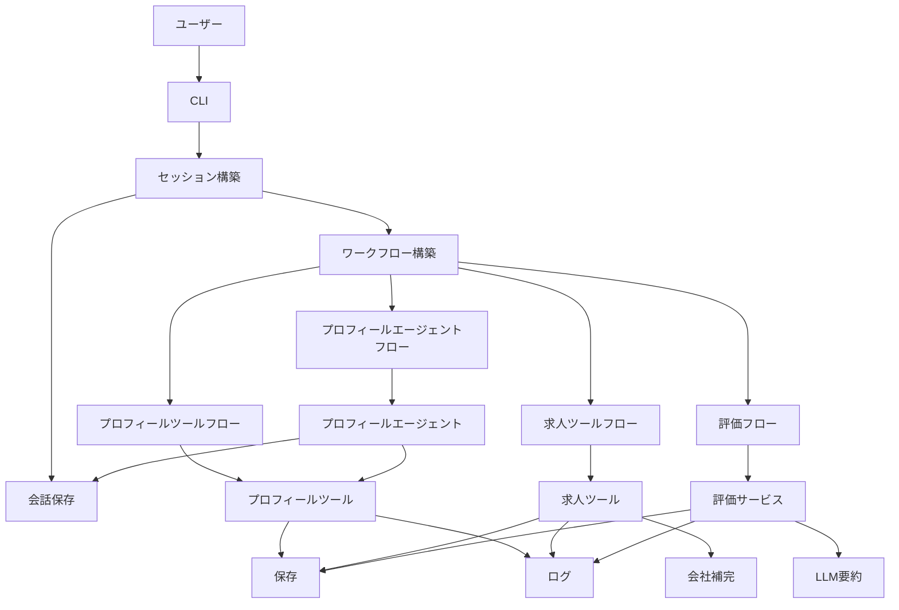
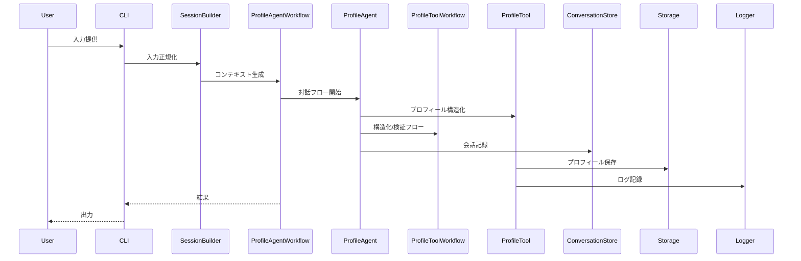
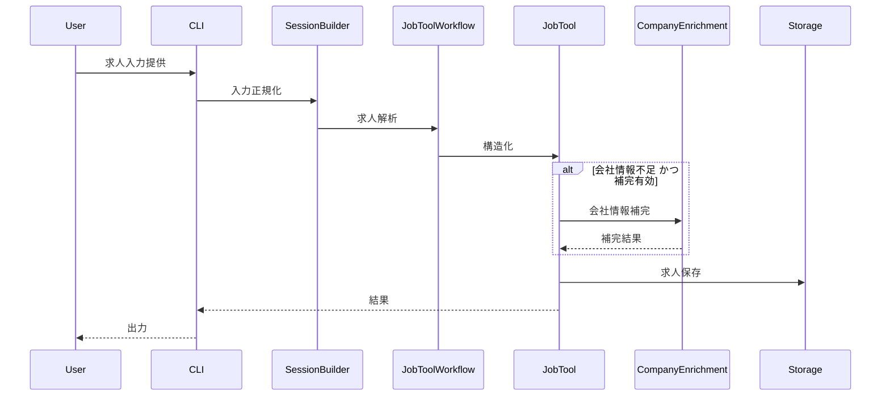
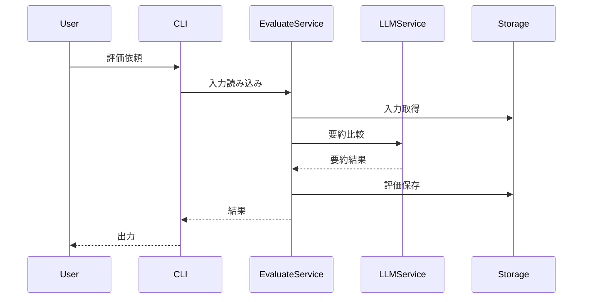

# 設計書

---
**目的**: 実装者間の解釈ズレを防ぐため、実装に必要な設計の一貫性を確保する。

**方針**:
- 実装判断に直結する必要最小限のセクションのみ記載する
- 必要性が低いセクションは無理に追加しない
- 機能の複雑性に応じて詳細度を調整する
- 長文より図表を優先する

**注意**: 1000行を超える場合は、機能の分割や設計簡素化を検討する。
---

> セクション順は必要に応じて入れ替えてよい（例: 要件トレーサビリティを前へ、データモデルをアーキテクチャ付近へ）。各セクション内は **概要 → 範囲 → 決定事項 → 影響/リスク** の流れを維持する。

## 概要 
キャリアエージェントのコア機能（プロフィール生成、求人解析、適合度評価）を CLI から一貫した実行フローで扱う設計を定義する。Profile Tool / Job Tool は LangGraph を用いたワークフローとして動作し、Profile Agent は対話補完を担う。入力の正規化、状態管理、永続化、ログ記録は共通基盤で統合する。

本設計は単一ユーザー運用を前提に、欠損のある入力でもドラフト保存を許容し、必要時に評価や比較を LLM に委譲できる構成とする。統合オーケストレーターは持たず、CLI または外部スクリプトが各エージェントを個別に実行してフローを構成する。CLI はコアサービスの呼び出しアダプタであり、同じコアロジックを外部から直接利用できる。求人・会社情報の補完は許可済み情報源のみに限定し、クローリングは禁止とする。

### 目標
- CLI から Profile Tool / Job Tool / Evaluate Agent を一貫した契約で実行できる
- 入力欠損時でもドラフトとして保存し、後続評価のための再利用性を確保する
- ログ・保存・出所情報を一貫して保持し、評価と比較の説明責任を担保する

### 非目標
- Web UI の表示・比較・閲覧機能
- 外部求人サイトのクローリングやスクレイピング
- 複数ユーザー向けのセッション管理や権限制御
- 勤務地希望や希望年収など就業条件の管理（別構造で扱う）
- エージェント間の統合オーケストレーション（別レイヤーで構成）

## アーキテクチャ

> `research.md` は背景情報として参照し、design.md は意思決定と契約を明記して単独でレビュー可能な内容にする。  
> 重要な判断は本文で明示し、構造は図に寄せて重複説明を避ける。

### 既存アーキテクチャの整理（該当時）
- CLI は Typer で構成され、profile サブコマンドを持つ。
- セッション構築は CLI 入力を正規化し、辞書形式でワークフローに渡す構成。
- LangGraph の StateGraph でワークフローを構築し、未実装ノードは警告を残す設計。

### アーキテクチャパターンと境界
**アーキテクチャ統合**:
- 選定パターン: アダプタ付きレイヤード・ワークフロー（CLI → セッション → ワークフロー → ドメインサービス → 保存）。既存構成に一致し、責務分離が明確。
- ドメイン境界: プロフィール/求人/評価を独立ドメインとして扱い、共通基盤は会話・ログ・保存に集約。
- 維持する既存パターン: セッション辞書、LangGraph StateGraph、警告の積み上げ。
- 追加コンポーネントの理由: プロフィール対話エージェント、求人/評価サービス、LLM 要約、会社補完アダプタを追加。
- ステアリング整合: 型ヒント必須、TDD、ログ・例外方針を維持。



### 技術スタック

| レイヤー | 選定 / バージョン | 役割 | 備考 |
|-------|------------------|-----------------|-------|
| フロントエンド / CLI | Typer >=0.20.0 | CLI 入力とバリデーション | Annotated 型を標準化 |
| バックエンド / サービス | Python 3.13 | エージェント実行環境 | 型ヒント必須 |
| ワークフロー | LangGraph >=1.0.1 | ワークフローの状態管理 | StateGraph を使用 |
| データ / ストレージ | ファイルベースJSON | プロフィール/求人/評価の保存 | UTF-8, 人間可読 |
| 実行基盤 / ランタイム | ローカルプロセス | 単一ユーザー運用 | セッション管理は限定 |

## システムフロー







## 要件トレーサビリティ

| 要件 | 要約 | コンポーネント | インターフェース | フロー |
|-------------|---------|------------|------------|-------|
| 1.1, 1.2, 1.3, 1.4, 1.5, 1.6 | 実行コンテキスト構築 | CLI, SessionBuilder, WorkflowBuilder, ProfileAgent, ProfileTool, JobTool, EvaluateService | ExecutionContext, SessionBuilderService | プロフィール/求人/評価 |
| 2.1, 2.2, 2.3, 2.4, 2.5, 2.6 | 会話ブロック管理 | ConversationStore, Logger | ConversationService | プロフィール/求人/評価 |
| 3.1, 3.2, 3.3 | ワークフローの最小経路と状態更新 | WorkflowBuilder, ProfileAgentWorkflow, ProfileToolWorkflow, JobToolWorkflow, EvaluateWorkflow | WorkflowFactory | プロフィール/求人/評価 |
| 4.1, 4.2, 4.3, 4.4, 4.5 | 保存・バックアップ・ログ | Storage, Logger | StoragePort | 全体 |
| 5.1, 5.2, 5.3, 5.4, 5.5, 5.6, 5.7, 5.8, 5.9, 5.10, 5.11, 5.12, 5.13, 5.14, 5.15 | プロフィールライフサイクル | ProfileTool, ProfileAgent, ProfileRepository | ProfileTool, ProfileAgent | プロフィール |
| 6.1, 6.2, 6.3, 6.4, 6.5, 6.6, 6.7, 6.8, 6.9 | 求人解析と会社補完 | JobTool, CompanyEnrichment | JobTool, CompanyLookupPort | 求人 |
| 7.1, 7.2, 7.3, 7.4, 7.5, 7.6, 7.7, 7.8, 7.9, 7.10, 7.11 | 評価と LLM 要約 | EvaluateService, LLMService | EvaluateService, LLMPort | 評価 |

## コンポーネントとインターフェース

| コンポーネント | ドメイン/レイヤー | 目的 | 要件カバレッジ | 主要依存 (P0/P1) | 契約 |
|-----------|--------------|--------|--------------|--------------------------|-----------|
| CLI Commands | CLI | 入力受付と実行開始 | 1.2, 1.3, 1.4, 1.6 | Typer (P0) | Service |
| SessionBuilder | セッション | 入力正規化と実行コンテキスト生成 | 1.1, 1.2, 1.5 | なし | Service, State |
| ConversationStore | セッション | 会話ブロックの記録 | 2.1, 2.2, 2.3, 2.4, 2.5, 2.6 | Storage (P1) | Service, State |
| WorkflowBuilder | ワークフロー | LangGraph でワークフロー構築 | 3.1, 3.2, 3.3 | LangGraph (P0) | Service |
| ProfileAgentWorkflow | ワークフロー | 対話フローの実行 | 5.6, 5.7, 5.8, 5.9 | LangGraph (P0) | Service |
| ProfileToolWorkflow | ワークフロー | 構造化/検証フローの実行 | 5.1, 5.2, 5.3, 5.4, 5.5 | LangGraph (P0) | Service |
| JobToolWorkflow | ワークフロー | 求人解析フローの実行 | 6.1, 6.2, 6.3, 6.4, 6.5, 6.6, 6.7, 6.8, 6.9 | LangGraph (P0) | Service |
| ProfileTool | プロフィール | プロフィール構築と更新 | 5.1, 5.2, 5.3, 5.4, 5.5, 5.6, 5.7, 5.8, 5.9, 5.10, 5.11, 5.12, 5.13, 5.14, 5.15 | Storage (P0) | Tool |
| ProfileAgent | プロフィール | 欠損補完の対話管理 | 5.6, 5.7, 5.8, 5.9 | ProfileTool (P0), ConversationStore (P0) | Agent |
| JobTool | 求人 | 求人解析と会社情報分離 | 6.1, 6.2, 6.3, 6.4, 6.5, 6.6, 6.7, 6.8, 6.9 | CompanyEnrichment (P1) | Tool |
| CompanyEnrichment | 求人 | 許可済み情報源で会社補完 | 6.3, 6.8 | 外部API (P1) | Service |
| EvaluateService | 評価 | 評価計算と要約管理 | 7.1, 7.2, 7.3, 7.4, 7.5, 7.6, 7.7, 7.8, 7.9, 7.10, 7.11 | LLMService (P0), Storage (P0) | Service |
| LLMService | 評価 | 要約生成の抽象化 | 7.6, 7.7, 7.8, 7.9, 7.10 | LLMプロバイダ (P0) | Service |
| Storage | 永続化 | JSON 保存とバックアップ | 4.1, 4.2, 4.3, 4.4, 4.5 | ローカルFS (P0) | Service, State |
| Logger | 可観測性 | 実行ログ記録 | 4.3 | ロギング (P0) | Service |

### CLI レイヤー

#### CLI Commands

| 項目 | 内容 |
|-------|--------|
| 目的 | CLI 入力を受け取り、適切なエージェント実行を開始する |
| 要件 | 1.2, 1.3, 1.4, 1.6 |

**責務と制約**
- 入力の存在・読取可否を CLI 層で検証する
- プロフィールは空入力でも開始できる
- CLI はコアサービスを呼び出すアダプタとして振る舞う

**依存関係**
- 受け取り: ユーザー — CLI 操作 (P0)
- 呼び出し: SessionBuilder — 実行コンテキスト構築 (P0)
- 外部: Typer — CLI 実装 (P0)

**契約**: Service [x] / API [ ] / Event [ ] / Batch [ ] / State [ ]

##### サービスインターフェース
```python
class CliEntrypoint(Protocol):
    def run(self, command: str, inputs: list[str]) -> int: ...
```
- 前提条件: 入力が必須のモードでは空でない
- 事後条件: 対応するエージェント実行が開始される
- 不変条件: CLI 入力の検証は SessionBuilder 前に実施

**実装ノート**
- 統合: Typer の Annotated 型を維持
- 検証: CLI での存在チェックを優先
- リスク: 誤ったオプション指定の UX

### セッションと会話履歴

#### SessionBuilder

| 項目 | 内容 |
|-------|--------|
| 目的 | 入力を正規化し実行コンテキストを生成する |
| 要件 | 1.1, 1.2, 1.5 |

**責務と制約**
- 入力順序を保持した正規化を行う
- プロフィールでは空入力を許容し、空の入力集合で開始する
- オプション値の既定値を補完する

**依存関係**
- 受け取り: CLI Commands — 入力受領 (P0)
- 呼び出し: WorkflowBuilder — 実行コンテキスト渡し (P0)

**契約**: Service [x] / API [ ] / Event [ ] / Batch [ ] / State [x]

##### サービスインターフェース
```python
class SessionBuilderService(Protocol):
    def build(self, mode: str, inputs: list[str], options: dict[str, object]) -> ExecutionContext: ...
```
- 前提条件: 必須入力のモードでは空でない
- 事後条件: 実行コンテキストが生成される
- 不変条件: 入力の順序は保持される

#### ConversationStore

| 項目 | 内容 |
|-------|--------|
| 目的 | 会話ブロックを順序付きで保存する |
| 要件 | 2.1, 2.2, 2.3, 2.4, 2.5, 2.6 |

**責務と制約**
- ユーザー入力とエージェント応答の 2 役割のみ許容
- 時系列順序を保持し追記方式で記録する

**依存関係**
- 受け取り: ProfileAgent / SessionBuilder — ブロック生成 (P1)
- 呼び出し: Storage — 永続化 (P1)

**契約**: Service [x] / API [ ] / Event [ ] / Batch [ ] / State [x]

##### サービスインターフェース
```python
class ConversationService(Protocol):
    def append(self, role: str, content: str, metadata: dict[str, object] | None = None) -> None: ...
    def list(self) -> list[ConversationBlock]: ...
```
- 前提条件: role は user または agent
- 事後条件: 追記されたブロックが保持される
- 不変条件: 順序は追加順を保持

### ワークフローオーケストレーション

#### WorkflowBuilder

| 項目 | 内容 |
|-------|--------|
| 目的 | LangGraph を用いてツール/エージェントのワークフローを組み立てる |
| 要件 | 3.1, 3.2, 3.3 |

**責務と制約**
- 最小実行経路（入力収集→検証）を保証する
- 状態更新は各ステップの責務に限定する
- 状態スキーマは TypedDict か dataclass で明示し、compile 済みグラフを返す

**依存関係**
- 受け取り: SessionBuilder — 実行コンテキスト (P0)
- 呼び出し: LangGraph — ワークフロー実行 (P0)

**契約**: Tool [x] / API [ ] / Event [ ] / Batch [ ] / State [ ]

##### サービスインターフェース
```python
class WorkflowFactory(Protocol):
    def build_profile_tool(self, context: ExecutionContext) -> WorkflowHandle: ...
    def build_profile_agent(self, context: ExecutionContext) -> WorkflowHandle: ...
    def build_job_tool(self, context: ExecutionContext) -> WorkflowHandle: ...
    def build_evaluate(self, context: ExecutionContext) -> WorkflowHandle: ...
```
- 前提条件: 必要な前提情報が揃っている
- 事後条件: 実行可能なワークフローが返る
- 不変条件: ノードは状態の必要部分のみ更新

### プロフィールドメイン

#### ProfileTool

| 項目 | 内容 |
|-------|--------|
| 目的 | プロフィールを構造化し、更新・保存まで管理する |
| 要件 | 5.1, 5.2, 5.3, 5.4, 5.5, 5.6, 5.7, 5.8, 5.9, 5.10, 5.11, 5.12, 5.13, 5.14, 5.15 |

**責務と制約**
- 入力から構造化プロフィールを生成する
- 欠損はドラフトとして保持し、欠損リストを返す
- 初期入力が空でもドラフトと欠損リストを返す
- 年齢は年齢帯、住所は都道府県レベルの情報として保持する
- 資格情報は文字列リストとして保持する

**依存関係**
- 受け取り: ProfileAgent — 構造化要求 (P0)
- 呼び出し: Storage — 永続化 (P0)

**契約**: Service [x] / API [ ] / Event [ ] / Batch [ ] / State [ ]

##### サービスインターフェース
```python
class ProfileTool(Protocol):
    def build(self, context: ExecutionContext) -> ProfileDraft: ...
    def finalize(self, draft: ProfileDraft) -> ProfileResult: ...
    def update(self, base: ProfileResult, context: ExecutionContext) -> ProfileResult: ...
```
- 前提条件: 入力は空でもよい
- 事後条件: ドラフトまたは完了プロフィールが得られる
- 不変条件: 欠損情報は必ず記録される

#### ProfileAgent

| 項目 | 内容 |
|-------|--------|
| 目的 | 欠損補完の対話を管理し、ProfileTool を呼び出して更新する |
| 要件 | 5.6, 5.7, 5.8, 5.9 |

**責務と制約**
- ProfileTool が返す欠損リストを基に質問を生成する
- 回答を ConversationStore に記録し、必要に応じて再構造化する
- ユーザー終了または試行上限時は未完了として保存する

**依存関係**
- 受け取り: WorkflowBuilder — 実行フロー (P0)
- 呼び出し: ProfileTool — 構造化/再構造化 (P0)
- 呼び出し: ConversationStore — 会話記録 (P0)

**契約**: Agent [x] / Service [ ] / API [ ] / Event [ ] / Batch [ ] / State [ ]

##### サービスインターフェース
```python
class ProfileAgent(Protocol):
    def run(self, context: ExecutionContext) -> ProfileResult: ...
```
- 前提条件: 実行コンテキストが生成されている
- 事後条件: 完了または未完了のプロフィールが返る
- 不変条件: 会話履歴に質問/回答が記録される

### 求人ドメイン

#### JobTool

| 項目 | 内容 |
|-------|--------|
| 目的 | 求人入力を解析し、会社情報を分離して保存する |
| 要件 | 6.1, 6.2, 6.3, 6.4, 6.5, 6.6, 6.7, 6.8, 6.9 |

**責務と制約**
- 求人情報を構造化し、会社情報を同一結果内に分離する
- 補完は許可された情報源のみを使用する

**依存関係**
- 受け取り: WorkflowBuilder — 実行フロー (P0)
- 呼び出し: CompanyEnrichment — 会社情報補完 (P1)
- 呼び出し: Storage — 永続化 (P0)

**契約**: Service [x] / API [ ] / Event [ ] / Batch [ ] / State [ ]

##### サービスインターフェース
```python
class JobTool(Protocol):
    def parse(self, context: ExecutionContext) -> JobResult: ...
```
- 前提条件: 入力が読取可能である
- 事後条件: 求人出力が保存される
- 不変条件: 会社補完は許可済み情報源のみ

#### CompanyEnrichment

| 項目 | 内容 |
|-------|--------|
| 目的 | 会社情報が不足する場合に許可された情報源から補完する |
| 要件 | 6.3, 6.8 |

**責務と制約**
- 許可済み API とユーザー入力のみを対象とする
- 取得不能時は警告を返し処理は継続する

**依存関係**
- 受け取り: JobTool — 補完要求 (P1)
- 外部: 許可済みAPI — 会社情報取得 (P1)

**契約**: Service [x] / API [ ] / Event [ ] / Batch [ ] / State [ ]

##### サービスインターフェース
```python
class CompanyLookupPort(Protocol):
    def enrich(self, company_context: CompanyContext) -> CompanySection | None: ...
```
- 前提条件: 会社識別情報がある
- 事後条件: 補完結果または None
- 不変条件: 取得不可の場合は警告のみ

### 評価ドメイン

#### EvaluateService

| 項目 | 内容 |
|-------|--------|
| 目的 | プロフィールと求人を評価し、要約を管理する |
| 要件 | 7.1, 7.2, 7.3, 7.4, 7.5, 7.6, 7.7, 7.8, 7.9, 7.10, 7.11 |

**責務と制約**
- 評価結果と根拠を生成し、出所情報を保持する
- LLM 要約は失敗時に明示的なエラーを返す

**依存関係**
- 受け取り: WorkflowBuilder — 実行フロー (P0)
- 呼び出し: Storage — 永続化 (P0)
- 呼び出し: LLMService — 要約生成 (P0)

**契約**: Service [x] / API [ ] / Event [ ] / Batch [ ] / State [ ]

##### サービスインターフェース
```python
class EvaluateService(Protocol):
    def score(self, profile: ProfileResult, job: JobResult) -> EvaluationResult: ...
    def summarize(self, evaluations: list[EvaluationResult]) -> EvaluationSummary: ...
```
- 前提条件: 評価入力が揃っている
- 事後条件: 評価結果が保存される
- 不変条件: 出所情報が欠落しない

#### LLMService

| 項目 | 内容 |
|-------|--------|
| 目的 | LLM を用いた要約生成を抽象化する |
| 要件 | 7.6, 7.7, 7.8, 7.9, 7.10 |

**責務と制約**
- 要約生成前に入力検証を行う
- プロンプトに出所と時刻を含める

**依存関係**
- 受け取り: EvaluateService — 要約要求 (P0)
- 外部: LLMプロバイダ — 生成 (P0)

**契約**: Service [x] / API [ ] / Event [ ] / Batch [ ] / State [ ]

##### サービスインターフェース
```python
class LLMPort(Protocol):
    def summarize(self, context: SummaryContext) -> SummaryResult: ...
```
- 前提条件: 評価結果が有効
- 事後条件: 要約が返る
- 不変条件: 出所情報が保持される

### 永続化と可観測性

#### Storage

| 項目 | 内容 |
|-------|--------|
| 目的 | JSON 保存とバックアップを担保する |
| 要件 | 4.1, 4.2, 4.3, 4.4, 4.5 |

**責務と制約**
- 既存データの上書き時にバックアップを取る
- 保存先が無い場合は作成するか明示的に失敗する

**依存関係**
- 受け取り: ProfileTool, JobTool, EvaluateService — 保存要求 (P0)
- 外部: ローカルFS — 永続化 (P0)

**契約**: Service [x] / API [ ] / Event [ ] / Batch [ ] / State [x]

##### サービスインターフェース
```python
class StoragePort(Protocol):
    def write(self, artifact: Artifact) -> StorageRef: ...
    def read(self, ref: StorageRef) -> Artifact: ...
    def backup(self, ref: StorageRef) -> StorageRef: ...
```
- 前提条件: 保存先が有効
- 事後条件: 保存結果が返る
- 不変条件: UTF-8 で保存される

#### Logger

| 項目 | 内容 |
|-------|--------|
| 目的 | 実行ログを所定の保存先に記録する |
| 要件 | 4.3 |

**責務と制約**
- 質問・警告・入力参照を記録する
- 機微情報はマスク方針に従う

**依存関係**
- 受け取り: 各サービス — ログ要求 (P0)
- 呼び出し: Storage — ログ保存 (P0)

**契約**: Service [x] / API [ ] / Event [ ] / Batch [ ] / State [ ]

##### サービスインターフェース
```python
class LogWriter(Protocol):
    def write(self, record: LogRecord) -> None: ...
```
- 前提条件: ログ保存先が有効
- 事後条件: ログが保存される
- 不変条件: 入力参照と警告が含まれる

## データモデル

### ドメインモデル
- ExecutionContext: 入力、モード、オプションを保持する実行単位
- ConversationBlock: 役割と内容を持つ会話履歴
- ProfileDraft / ProfileResult: 欠損情報と年齢帯/都道府県/資格を含むプロフィール成果物
- JobResult: 求人情報と会社情報セクションを含む成果物
- EvaluationResult / EvaluationSummary: 適合度評価と要約成果物

### 論理データモデル

**構造定義**:
- プロフィールはメタ情報、要約、経歴、計画、資格のセクションを持つ
- 求人結果は求人本体と会社情報のセクションを分離して保持する
- 評価結果はスコア、根拠、参照元情報、時刻情報を持つ
- 会話ブロックは発話順序と役割を保持する

**整合性と完全性**:
- ドラフト状態は欠損リストを保持し、評価フェーズでは欠損を検知する
- 出所情報は評価と要約の両方で必須
- ログは保存先と同期し、欠落しない

### データ契約と連携
- 保存形式は人間可読な JSON で統一する
- 入力はテキストまたはファイルを受け付け、出所は参照情報に含める
- LLM 要約はプロンプトに出所と時刻を含める
- 成果物はファイルとして永続化し、次の工程はその参照情報を明示的に受け渡す

## エラーハンドリング

### エラー方針
- 入力欠損は早期に検知し、エージェント実行前に停止する
- プロフィールは空入力から対話で開始できるが、求人/評価は必須入力が無い場合に前提エラーとする
- プロフィールは欠損があってもドラフト保存し、致命的にしない
- 評価は必須入力が欠ける場合に明示的に失敗する

### エラー種別と対応
**ユーザーエラー**: 入力欠損、ファイル未読、オプション不正
**システムエラー**: ファイル保存失敗、LLM 応答失敗
**業務ロジックエラー**: 必須要素欠損による評価不可

### 監視
- ログは警告と入力参照を含めて保存する
- 例外は CLI でユーザーに明確に提示する

## テスト戦略

- ユニットテスト: セッション正規化、欠損判定、評価要約の入力検証
- 統合テスト: プロフィール/求人/評価の各ワークフロー実行
- CLIテスト: Typer CLI のオプション検証とエラー系
- モック: LLM/外部 API はモックで隔離

## 任意セクション（該当時）

### セキュリティ考慮事項
- 機微情報はログ・保存時にマスクし、出所情報のみを保持する
- 外部 API のキーは環境変数等で管理し、リポジトリに残さない

### 性能とスケーラビリティ
- LLM 要約は最も重い処理であり、入力数が多い場合はバッチ処理を検討する
- ファイル保存は単一ユーザー運用を前提に最小限の I/O で設計する
