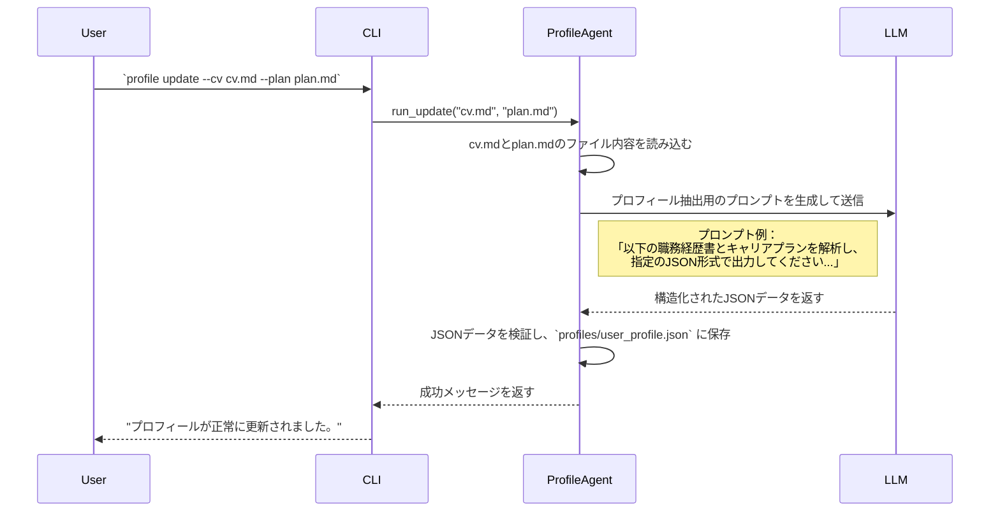
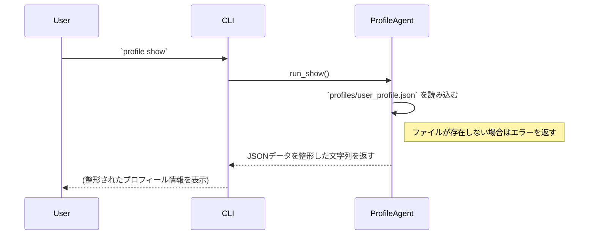

# 詳細設計書：ユーザープロフィール管理機能 (Profile Agent)

## 1. 機能概要

ユーザーの職務経歴書およびキャリアプランに関するドキュメントを解析し、求人評価の基準となる構造化されたプロフィールデータ（JSON形式）を生成・管理する。本機能は、`profile` コマンド群を通じて操作される。

## 2. 責務

- ユーザーから指定された入力ファイル（職務経歴書、キャリアプラン）の内容を読み込む。
- 大規模言語モデル（LLM）を活用し、入力ファイルの内容を解析・抽出し、標準化されたJSON形式のプロフィールデータを生成する。
- 生成・更新されたプロフィールデータを、プロジェクト内の所定のパス (`profiles/user_profile.json`) に永続化する。
- 保存されているプロフィールデータを読み込み、ユーザーに表示する。

## 3. コマンド体系 (CLIインターフェース)

| コマンド | オプション | 説明 |
| :--- | :--- | :--- |
| `profile update` | `--cv <path>`<br>`--plan <path>` | 職務経歴書（`--cv`）およびキャリアプラン（`--plan`）のファイルパスを指定して、プロフィールを生成・更新する。`--cv` は必須。 |
| `profile show` | (なし) | 現在保存されているプロフィール情報を整形して表示する。 |

## 4. データ構造 (`profiles/user_profile.json`)

LLMによって生成され、ファイルに保存されるプロフィールのJSON構造を以下のように定義する。

```json
{
  "metadata": {
    "source_cv_path": "path/to/your/cv.md",
    "source_plan_path": "path/to/your/plan.md",
    "last_updated": "2025-07-28T12:00:00Z"
  },
  "summary": {
    "identity": "経験豊富なソフトウェアエンジニア。特にバックエンド開発とクラウドインフラ構築に強みを持つ。",
    "overall_experience_years": 10
  },
  "skills": [
    {
      "name": "Python",
      "level": 5,
      "experience_years": 10,
      "details": "Web API開発、データ処理バッチ、機械学習プロトタイピングなどで利用。"
    },
    {
      "name": "TypeScript",
      "level": 4,
      "experience_years": 5,
      "details": "React/Next.jsでのフロントエンド開発、Node.jsでのBFF開発経験。"
    },
    {
      "name": "AWS",
      "level": 4,
      "experience_years": 6,
      "details": "EC2, S3, Lambda, ECS, VPCなどを用いたインフラ設計・構築・運用経験。"
    }
  ],
  "work_experience": [
    {
      "company": "株式会社A",
      "period": "2020-04 - 現在",
      "position": "シニアソフトウェアエンジニア",
      "summary": "BtoB向けSaaSプロダクトのバックエンド開発を担当。マイクロサービスアーキテクチャへの移行を主導し、開発効率を30%向上させた。"
    },
    {
      "company": "株式会社B",
      "period": "2015-04 - 2020-03",
      "position": "ソフトウェアエンジニア",
      "summary": "受託開発プロジェクトにて、Webアプリケーションの設計からテストまで一貫して担当。"
    }
  ],
  "career_plan": {
    "wants_to_do": "技術的負債の解消やスケーラビリティの高いシステム設計など、技術的な課題解決に深く関わりたい。将来的には、技術選定やアーキテクチャ設計をリードするテックリードの役割を担いたい。",
    "interests": ["マイクロサービス", "分散システム", "オブザーバビリティ"],
    "preferences": {
      "team_size": "5-10人程度",
      "discretion": "技術選定や設計に関する裁量が大きい環境",
      "work_style": "週2-3日のリモートワークを希望",
      "company_culture": "技術的な議論が活発で、学び合いの文化がある"
    }
  },
  "values": ["技術的挑戦", "ワークライフバランス", "プロダクトへの貢献"]
}
```

## 5. 処理フロー

### 5.1. `profile update` コマンド実行時



### 5.2. `profile show` コマンド実行時



## 6. 今後の拡張性

- **入力ソースの多様化:** `cv.md` のようなローカルファイルだけでなく、LinkedInプロフィールのURLや、JSON/YAML形式の直接入力にも対応する。
- **対話による更新:** `profile update` 時に、不足している情報（例：「あなたの最も重視する価値観を3つ教えてください」）を対話形式でヒアリングし、プロフィールの精度を高める機能を追加する。
