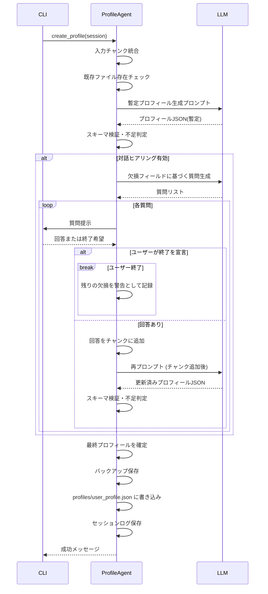
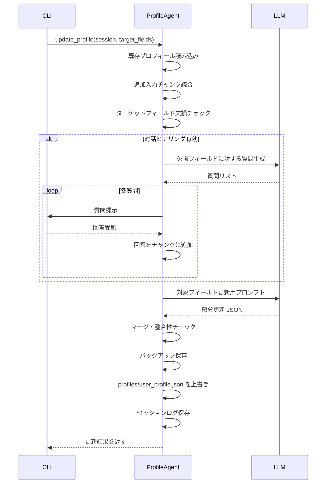
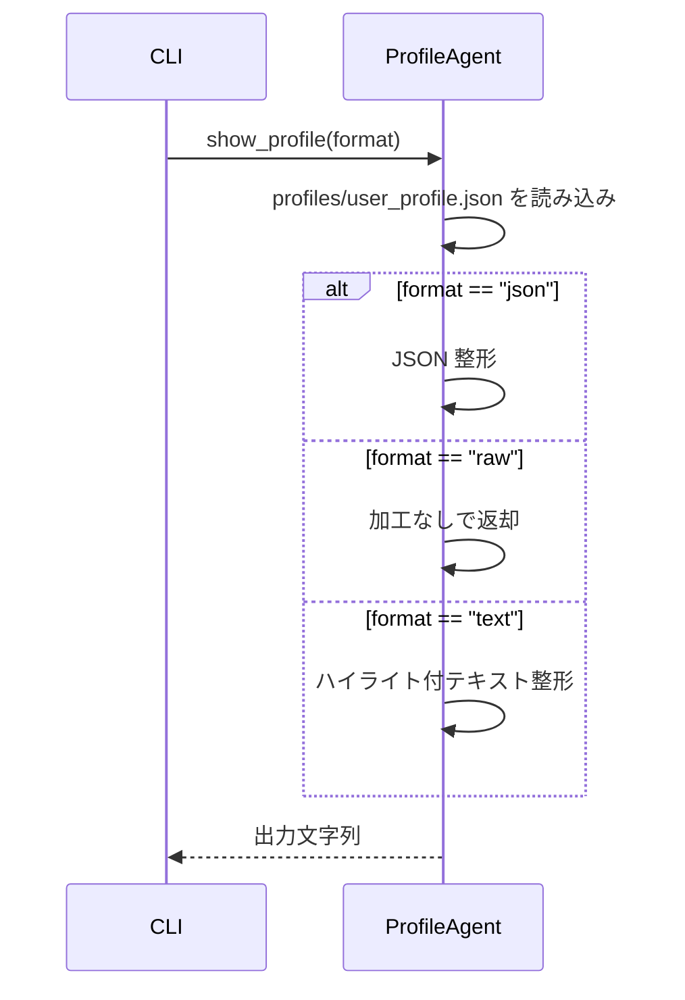

# 詳細設計書：ユーザープロフィール管理機能 (Profile Agent)

## 1. 機能概要

Profile Agent は、ユーザーが提供するテキスト情報（貼り付け入力・ファイル指定・インタラクティブ回答）を分析し、求人評価に利用する構造化プロフィールを生成・更新・表示するエージェントである。CLI から `profile create` / `profile update` / `profile show` コマンドで呼び出されるほか、将来的に他エージェントや外部スクリプトから直接利用できる API を提供する。

## 2. 責務

- 入力収集: ユーザーによる貼り付け・ファイル指定・対話回答を統合し、プロフィール生成に必要な原文テキストを構築する。
- 情報補完: 不足フィールドを検出し、ヒアリング質問（LLM 生成）を提示して回答を収集する。対話は既定で有効とし、`--no-interactive` 時にのみスキップする。
- プロフィール生成: 収集した情報を LLM に送信して構造化 JSON を生成し、スキーマ検証を行う。
- 永続化: プロフィールデータ（`profiles/user_profile.json`）と、入力ソースのメタ情報・質疑応答ログを保存する。
- 表示: 保存済みプロフィールをテキスト整形または JSON 形式で出力する。
- 再利用: 部分更新時に既存プロフィールを読み込み、指定フィールドのみを再生成／追記する。

## 3. インターフェース

### 3.1 CLI コマンド

> 注記: オプション仕様は本設計の指針を示すもので、最終的な引数定義は実装段階で微調整する可能性がある。

| コマンド | 主なオプション | 既定挙動 | 概要 |
| --- | --- | --- | --- |
| `profile create` | `--file <path>` (複数可), `--force`, `--no-interactive` | 対話ヒアリングあり | 初期プロフィールを生成。既存ファイルがある場合は `--force` が無ければ中断。貼り付け入力とファイル読込を統合して LLM に渡す。 |
| `profile update` | `--fields <list>`, `--file <path>` (複数可), `--no-interactive` | 対話ヒアリングあり | 既存プロフィールの指定領域を再生成／補完。追加入力の貼り付けやファイルを受け取り、欠損フィールドに対する質問を行う。 |
| `profile show` | `--format text|json`, `--raw` | `text` | 保存済みプロフィールを表示。`--raw` 指定時は保存ファイルの JSON をそのまま出力。 |

### 3.2 内部 API（想定）

| メソッド | 引数 | 返り値 | 説明 |
| --- | --- | --- | --- |
| `create_profile(session: ProfileSession) -> ProfileResult` | 入力ソース、ヒアリング設定、保存先 | プロフィール JSON, メタ情報 | 初回作成フローを実行。既存データがある場合はエラーを返すか `session.force_overwrite` で上書き。 |
| `update_profile(session: ProfileSession, target_fields: list[str]) -> ProfileResult` | ターゲットフィールド、追加入力、ヒアリング設定 | 更新済みプロファイル | 部分更新対象を評価し、差分だけ LLM に再生成させてマージ。 |
| `show_profile(format: Literal['text','json','raw']) -> str` | 表示形式 | 整形済み文字列 | 保存ファイルを読み込み、整形または生データを返す。 |

## 4. 入力モードとセッション管理

### 4.1 入力ソース

- **貼り付け入力**: CLI 実行時に標準入力から受け取るテキストブロック。複数ブロックを順序付けて保持する。
- **ファイル入力 (`--file`)**: Markdown / プレーンテキストなどを読み込み、ファイルパスと共にセッションへ登録する。指定順を保持し、メタデータに格納する。
- **ヒアリング回答**: 対話モードで提示した質問に対するユーザー回答。質問ごとに `question_id`, `prompt`, `answer` を記録する。

### 4.2 セッション構造

| フィールド | 型の目安 | 説明 |
| --- | --- | --- |
| `mode` | `"create"` / `"update"` | 実行モードの識別子。 |
| `input_chunks` | 配列 | `{id, source, path?, content}` を持つチャンク群。`source` は `paste` / `file` / `qa` のいずれか。 |
| `interactive` | 真偽値 | `false` の場合 `--no-interactive` が指定されたことを表す。 |
| `target_fields` | 文字列配列 (任意) | `profile update` 時に再生成するフィールド名一覧。 |
| `force_overwrite` | 真偽値 (任意) | `profile create` で既存プロフィールを上書きするかどうか。 |
| `profile_path` | 文字列 | 保存先パス。既定値は `profiles/user_profile.json`。 |
| `timestamp` | 文字列 | ISO 8601 形式の実行時刻。ログやバックアップ命名に利用する。 |

セッションは CLI 層で構築し、エージェント内部に渡す。`interactive = true` の場合のみヒアリングフェーズに進む。`target_fields` が指定されない場合、更新対象は LLM に自動検出させる方針としつつ、実装時に許可するか検討する。

### 4.3 ヒアリングフロー

1. **欠損判定**: 既存プロフィールおよび入力テキストから、必須／推奨フィールドの充足度を判定する。
2. **質問生成**: LLM に対して「欠損フィールド」「必要な追加情報」「聞き方のトーン」を渡し、質問リストを生成する。
3. **質問提示**: CLI が質問を表示し、ユーザーの回答を受け取る。回答は逐次 `inputChunks` に追記。
4. **再評価**: 追加回答を反映した後、残りの欠損があれば再度質問生成を行う。最大試行回数やキャンセル条件を設ける。

`--no-interactive` 指定時は 1 の欠損判定までで止め、未充足フィールドリストを警告として出力する（エラー扱いにするかは詳細設計で決定）。

## 5. データ構造

### 5.1 プロフィールデータの全体像

| フィールド | Python型の目安 | 必須 | 説明 | 例 |
| --- | --- | --- | --- | --- |
| `metadata` | `Metadata` | 必須 | 入力ソースや更新日時などの付帯情報。 | `{...}` |
| `summary` | `Summary` | 必須 | ユーザー概要、経験年数、ハイライト。 | `{...}` |
| `career` | `Career` | 推奨 | スキル・職務経歴など現在までの実績。 | `{ "skills": [...], "experiences": [...] }` |
| `plan` | `Plan \| None` | 推奨 | 今後の志向や希望条件。情報がなければ `None`。 | `{...}` |

#### 5.1.1 `Metadata`

| フィールド | Python型の目安 | 必須 | 説明 | 例 |
| --- | --- | --- | --- | --- |
| `input_sources` | `list[InputSource]` | 必須 | 使用した入力チャンクの一覧。順序を保持。 | `[{"id": "chunk-1", ...}]` |
| `last_updated` | `datetime`（ISO8601文字列） | 必須 | 最終更新日時。 | `"2025-07-30T12:00:00Z"` |
| `version` | `int \| None` | 任意 | スキーマや更新回数の管理に使用。 | `1` |

`InputSource` の詳細:

| フィールド | Python型の目安 | 必須 | 説明 | 例 |
| --- | --- | --- | --- | --- |
| `id` | `str` | 必須 | チャンク識別子。 | `"chunk-1"` |
| `type` | `Literal["paste","file","qa"]` | 必須 | 入力種別。 | `"file"` |
| `label` | `str \| None` | 任意 | 人間向けラベル。 | `"cv.md"` |
| `path` | `str \| None` | 任意 | 元ファイルパス。貼り付け入力時は `None`。 | `"docs/cv.md"` |

#### 5.1.2 `Summary`

| フィールド | Python型の目安 | 必須 | 説明 | 例 |
| --- | --- | --- | --- | --- |
| `identity` | `str` | 必須 | 自己紹介や肩書き。 | `"バックエンドエンジニア"` |
| `overall_experience_years` | `int \| None` | 推奨 | 実務年数。未知なら `None`。 | `10` |
| `notable_highlights` | `list[str] \| None` | 任意 | 特筆すべき実績。 | `["SaaS開発リード"]` |

#### 5.1.3 `Career`

| フィールド | Python型の目安 | 必須 | 説明 | 例 |
| --- | --- | --- | --- | --- |
| `skills` | `list[SkillEntry]` | 推奨 | スキルセットの詳細。空リスト可。 | `[{"name": "Python", ...}]` |
| `experiences` | `list[ExperienceEntry]` | 推奨 | 職務経歴リスト。 | `[{"company": "株式会社A", ...}]` |
| `certifications` | `list[str] \| None` | 任意 | 資格・認定。 | `["AWS Solutions Architect"]` |
| `languages` | `list[str] \| None` | 任意 | 使用言語（自然言語）。 | `["ja", "en"]` |

`SkillEntry` の詳細:

| フィールド | Python型の目安 | 必須 | 説明 | 例 |
| --- | --- | --- | --- | --- |
| `name` | `str` | 必須 | スキル名。 | `"Python"` |
| `level` | `int \| None` | 推奨 | 自己評価（1-5 など）。 | `5` |
| `experience_years` | `float \| None` | 任意 | 使用年数。 | `10.0` |
| `details` | `str \| None` | 任意 | 実績詳細。 | `"API開発、データ処理"` |

`ExperienceEntry` の詳細:

| フィールド | Python型の目安 | 必須 | 説明 | 例 |
| --- | --- | --- | --- | --- |
| `company` | `str` | 必須 | 企業名／組織名。 | `"株式会社A"` |
| `period` | `str` | 必須 | 在籍期間（自由記述）。 | `"2020-04 - 現在"` |
| `position` | `str \| None` | 推奨 | 役職・担当。 | `"シニアソフトウェアエンジニア"` |
| `achievements` | `list[str] \| None` | 任意 | 代表的な成果。 | `["マイクロサービス移行を主導"]` |
| `summary` | `str \| None` | 任意 | 業務内容の概要。 | `"SaaSプロダクトのバックエンド開発を担当"` |

#### 5.1.4 `Plan`

| フィールド | Python型の目安 | 必須 | 説明 | 例 |
| --- | --- | --- | --- | --- |
| `wants_to_do` | `str \| None` | 推奨 | 今後やりたい業務。 | `"技術的負債解消に取り組みたい"` |
| `interests` | `list[str] \| None` | 任意 | 興味領域。 | `["マイクロサービス", "分散システム"]` |
| `preferences` | `PlanPreferences \| None` | 任意 | 働き方や条件面の希望。 | `{...}` |
| `avoid` | `PlanAvoidance \| None` | 任意 | 避けたい条件やNG事項。 | `{...}` |

`PlanPreferences` の詳細:

| フィールド | Python型の目安 | 必須 | 説明 | 例 |
| --- | --- | --- | --- | --- |
| `team_size` | `str \| None` | 任意 | 希望するチーム規模。 | `"5-10人"` |
| `work_style` | `str \| None` | 任意 | 働き方（例: ハイブリッド、リモート頻度）。 | `"週2-3日のリモート"` |
| `working_hours` | `str \| None` | 任意 | 勤務時間帯や柔軟性。 | `"フレックス希望"` |
| `location` | `list[str] \| None` | 任意 | 希望勤務地（都市・国・タイムゾーン）。 | `["東京23区内", "リモート"]` |
| `salary_expectation` | `SalaryExpectation \| None` | 任意 | 年収・報酬レンジの希望。 | `{...}` |

`PlanAvoidance` の詳細:

| フィールド | Python型の目安 | 必須 | 説明 | 例 |
| --- | --- | --- | --- | --- |
| `must_avoid` | `list[str] \| None` | 任意 | 絶対に避けたい条件。 | `["完全出社", "深夜常駐"]` |
| `cautions` | `list[str] \| None` | 任意 | 可能なら避けたい／留意事項。 | `["SES案件多めの現場", "形骸化したレビュー文化"]` |

`SalaryExpectation` の詳細:

| フィールド | Python型の目安 | 必須 | 説明 | 例 |
| --- | --- | --- | --- | --- |
| `currency` | `str \| None` | 任意 | 通貨コード。 | `"JPY"` |
| `minimum` | `int \| None` | 任意 | 希望下限（年収等）。 | `8000000` |
| `target` | `int \| None` | 任意 | 希望目標値。 | `9000000` |
| `maximum` | `int \| None` | 任意 | 許容上限。 | `12000000` |

### 5.2 Python 型定義イメージ

実装時には以下のようなデータクラス／型エイリアスを想定する。

```python
from dataclasses import dataclass
from datetime import datetime
from typing import Literal, Optional

InputSourceType = Literal["paste", "file", "qa"]

@dataclass
class InputSource:
    id: str
    type: InputSourceType
    label: Optional[str] = None
    path: Optional[str] = None

@dataclass
class Metadata:
    input_sources: list[InputSource]
    last_updated: datetime
    version: Optional[int] = None

@dataclass
class Summary:
    identity: str
    overall_experience_years: Optional[int] = None
    notable_highlights: Optional[list[str]] = None

@dataclass
class SkillEntry:
    name: str
    level: Optional[int] = None
    experience_years: Optional[float] = None
    details: Optional[str] = None

@dataclass
class ExperienceEntry:
    company: str
    period: str
    position: Optional[str] = None
    achievements: Optional[list[str]] = None
    summary: Optional[str] = None

@dataclass
class Career:
    skills: list[SkillEntry]
    experiences: list[ExperienceEntry]
    certifications: Optional[list[str]] = None
    languages: Optional[list[str]] = None

@dataclass
class SalaryExpectation:
    currency: Optional[str] = None
    minimum: Optional[int] = None
    target: Optional[int] = None
    maximum: Optional[int] = None

@dataclass
class PlanPreferences:
    team_size: Optional[str] = None
    work_style: Optional[str] = None
    working_hours: Optional[str] = None
    location: Optional[list[str]] = None
    salary_expectation: Optional[SalaryExpectation] = None

@dataclass
class PlanAvoidance:
    must_avoid: Optional[list[str]] = None
    cautions: Optional[list[str]] = None

@dataclass
class Plan:
    wants_to_do: Optional[str] = None
    interests: Optional[list[str]] = None
    preferences: Optional[PlanPreferences] = None
    avoid: Optional[PlanAvoidance] = None
```

### 5.3 サンプル JSON

テーブル仕様に基づく例を参考として掲載する。

```json
{
  "metadata": {
    "input_sources": [
      { "id": "chunk-1", "type": "file", "label": "cv.md", "path": "docs/cv.md" },
      { "id": "chunk-2", "type": "qa", "label": "plan-preferences" }
    ],
    "last_updated": "2025-07-30T12:00:00Z",
    "version": 1
  },
  "summary": {
    "identity": "バックエンドエンジニア",
    "overall_experience_years": 10,
    "notable_highlights": [
      "SaaSプロダクトの開発チームをリード",
      "マイクロサービスへの移行を主導"
    ]
  },
  "career": {
    "skills": [
      {
        "name": "Python",
        "level": 5,
        "experience_years": 10,
        "details": "API設計、バッチ処理、データ解析"
      }
    ],
    "experiences": [
      {
        "company": "株式会社A",
        "period": "2020-04 - 現在",
        "position": "シニアソフトウェアエンジニア",
        "achievements": ["マイクロサービス移行を主導"],
        "summary": "BtoB向けSaaSのバックエンド開発を担当"
      }
    ],
    "certifications": ["AWS Solutions Architect"],
    "languages": ["ja", "en"]
  },
  "plan": {
    "wants_to_do": "技術的負債の解消やスケーラビリティ改善に取り組みたい",
    "interests": ["マイクロサービス", "分散システム"],
    "preferences": {
      "team_size": "5-10人",
      "work_style": "週2-3日のリモートワーク",
      "working_hours": "フレックス希望",
      "location": ["東京23区内", "リモート"],
      "salary_expectation": {
        "currency": "JPY",
        "minimum": 8000000,
        "target": 9000000,
        "maximum": 12000000
      }
    },
    "avoid": {
      "must_avoid": ["完全出社", "長期出張を伴う配属"],
      "cautions": ["夜間シフト中心のチーム", "文化的に閉鎖的な組織"]
    }
  }
}
```

### 5.4 セッションログ

| フィールド | Python型の目安 | 必須 | 説明 | 例 |
| --- | --- | --- | --- | --- |
| `session_id` | `str` | 必須 | 実行ごとの一意な識別子。 | `"2025-07-30T12-00-00_create"` |
| `mode` | `Literal["create","update"]` | 必須 | 実行モード。 | `"create"` |
| `questions` | `list[QuestionLog]` | 任意 | ヒアリングで提示した質問と回答。 | `[{"id": "q1", ...}]` |
| `warnings` | `list[str]` | 任意 | 未補完フィールドなどの注意事項。 | `["plan.preferences.location が未入力"]` |

`QuestionLog` の詳細:

| フィールド | Python型の目安 | 必須 | 説明 | 例 |
| --- | --- | --- | --- | --- |
| `id` | `str` | 必須 | 質問 ID。 | `"q1"` |
| `field` | `str` | 必須 | 質問対象のフィールド名。 | `"plan.preferences.location"` |
| `prompt` | `str` | 必須 | 提示した質問文。 | `"希望する勤務地やタイムゾーンがあれば教えてください"` |
| `answer` | `str \| None` | 必須 | ユーザー回答。無回答の場合は `None`。 | `"東京23区内、フルリモート可"` |

セッションログも JSON で保存し、必要に応じて解析・評価に利用する。

## 6. LLM プロンプト設計

### 6.1 プロフィール生成プロンプト

- 入力: セッションのテキストチャンクを結合し、プロフィールスキーマの説明と共に LLM に提示。
- 期待出力: 上記 JSON スキーマに準拠。欠損フィールドは空配列／空文字ではなく `null` を利用するよう指示し、後続処理で補完しやすくする。
- 一貫性: 既存プロフィールがある場合、変更対象フィールドのみ更新し、それ以外は既存値を保持するようプロンプト内で指示する。

### 6.2 質問生成プロンプト

- 入力: 未充足フィールド一覧、既知情報のサマリ、質問トーン（丁寧・簡潔など）。
- 期待出力: `[{"id": "q1", "field": "plan.preferences.location", "question": "..."}]` や `plan.avoid.must_avoid` を問うパターンなど、マルチフィールドに対応可能な形式。
- 応答数: 1 回の生成で 1〜3 個の質問を返す。ユーザー回答後に再度欠損チェックを実施。

### 6.3 バリデーションプロンプト

- プロフィール JSON がスキーマに適合しない場合、エラー詳細を LLM へ渡し再生成を依頼するフォールバックプロンプトを定義する。

## 7. バリデーションとエラーハンドリング

- JSON スキーマ検証: `metadata`, `summary`, `career`, `plan` など必須キーをチェック。欠損時は LLM への再プロンプト。
- 衝突処理: `profile create` で既存ファイルが存在する場合はエラーを出し、`--force` 指定時のみ上書き。
- `profile update` で対象フィールドが存在しない場合、警告を出し新規フィールドとして扱うかエラーとするかを設定で制御。
- ヒアリング中断: ユーザーが空回答を連続した場合、最大試行回数に達したら対話を終了し、未補完フィールド一覧を保存／警告する。

## 8. 永続化と入出力

- プロフィール本体: `profiles/user_profile.json`
- セッションログ: `profiles/session_logs/<timestamp>_<mode>.json`
- バックアップ: `profiles/backups/<timestamp>.json` に直前のプロフィールをコピーし、更新失敗時のロールバックを可能にする。
- エンコーディング: UTF-8。整形出力（2 スペースインデント）を基本とし、人間が参照しやすい形式を維持する。

## 9. 処理フロー

### 9.1 `profile create`



### 9.1.1 処理フロー詳細 (create)

1. **セッション初期化**  
   CLI 層が `ProfileSession` を構築する。標準入力で受け取った貼り付けテキスト、`--file` で指定されたファイル、既定で有効な対話設定（`interactive=True`）などをまとめ、入力チャンクを `session.input_chunks` として渡す。既存プロフィールが存在する場合は、安全策としてエージェント側で上書き可否を確認する。

2. **既存ファイル検査とバックアップ準備**  
   Profile Agent が保存先 (`profiles/user_profile.json`) を確認し、ファイルが存在する場合は `session.force_overwrite` の有無をチェック。上書きが許可されている場合は、処理成功時に健全なバックアップを取れるようバックアップ先パスも決定しておく。

3. **入力チャンク統合と前処理**  
   貼り付けテキストやファイル内容を読み込み、メタ情報（チャンクID、ソース種別、オリジナルパスなど）を付加。Markdown → プレーンテキスト化など必要な前処理を施し、プロンプト生成で利用しやすい形に整形する。

4. **初回プロフィール生成**  
   後続の欠損判定やヒアリングの精度を高めるため、現時点のチャンクを使って暫定プロフィールを生成する。以下の流れを基本単位として以後も繰り返す。  
   1. チャンク統合内容をもとに LLM へプロフィール生成を依頼  
   2. 受け取った JSON をスキーマ検証  
   3. バリデーションを通過したら暫定プロフィールを保持（オンメモリまたは一時ファイル）  
   4. 必須フィールドが欠けている場合は欠損一覧を更新

5. **ヒアリング (対話モードの場合)**  
   `session.interactive` が True の場合、欠損候補をもとに LLM へ「追加で確認すべき質問」を問い合わせる。返ってきた質問リストを順番に CLI へ表示し、ユーザーの応答を受け取って `session.input_chunks` に `type="qa"` として追記する。質問は 1 循環ごとに欠損状況を再評価し、十分に補完できた段階でヒアリングを終了する。`--no-interactive` 指定時は本ステップをスキップし、未充足項目を警告として記録する。

6. **逐次プロフィール更新**  
   ヒアリングで新しい回答が得られるたびに、チャンク統合→プロフィール生成→スキーマ検証を再実行する。プロンプトでは差分更新を指示し、既に確定済みのフィールドは保持する。逐次更新はコストが増えるため、実装では以下の工夫を検討する。  
   - 差分プロンプト: 変更対象フィールドのみ LLM に伝える。  
   - バッチ更新: 質問数件分をまとめて再生成し、呼び出し回数を抑える。  
   - 再利用キャッシュ: 同一チャンク構成なら先行結果を再利用する。

7. **終了判定**  
   欠損リストが空になった／もしくはユーザーが「これ以上補足しない」と明示した場合はヒアリングを終える。`--no-interactive` やユーザー中断時には、未補完項目の一覧を `warnings` として保持する。

8. **最終バリデーション**  
   最後に再度プロフィール生成・検証を実施し、保存してよい状態かを確認する。連続失敗時はエラーメッセージを返却し処理を中断する。

9. **バックアップと書き込み**  
   ファイルが存在していた場合はまず既存プロフィールを `profiles/backups/<timestamp>.json` にコピーし、その後新しい JSON を `profiles/user_profile.json` に保存する。保存時は UTF-8、2 スペースインデントで整形し、読みやすさを保つ。

10. **セッションログ保存**  
    ヒアリングで投げた質問とユーザー回答、欠損項目の補完状況などを `profiles/session_logs/<timestamp>_create.json` に書き出す。`--no-interactive` の場合は警告欄に未補完フィールドを記録する。

11. **結果返却**  
    CLI に対して成功メッセージを返し、保存先パスや警告（未補完箇所がある場合）を併せて通知する。CLI はこれをそのままユーザーへ表示する。

### 9.2 `profile update`



### 9.3 `profile show`


