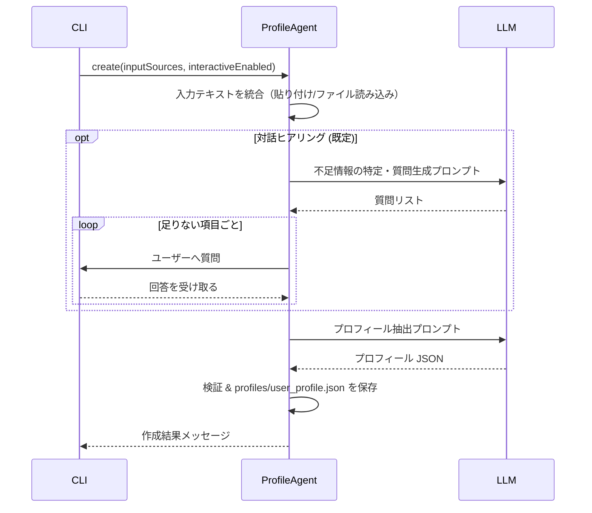
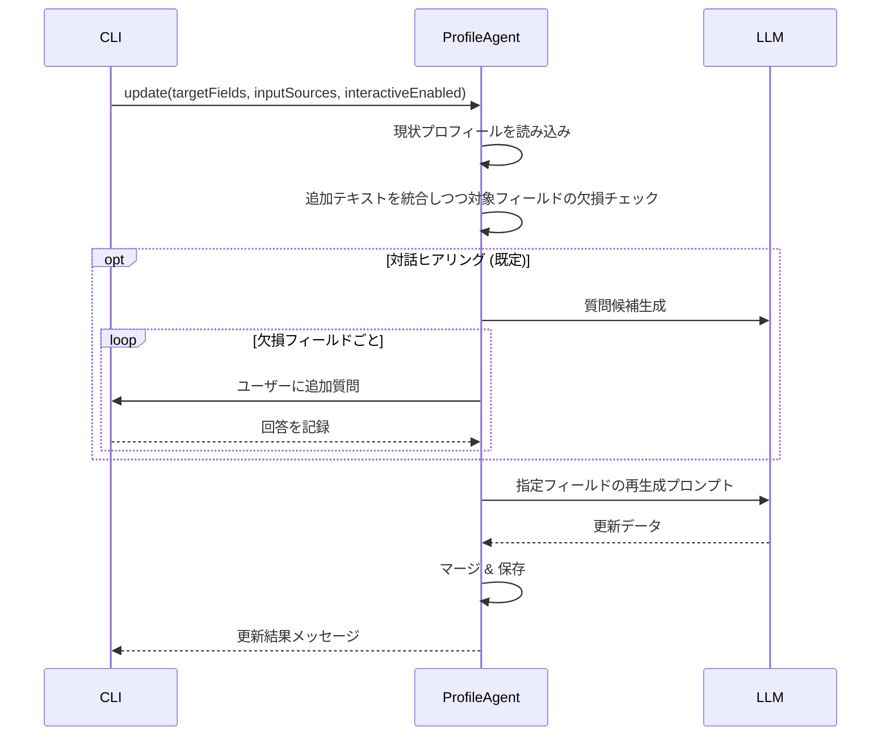
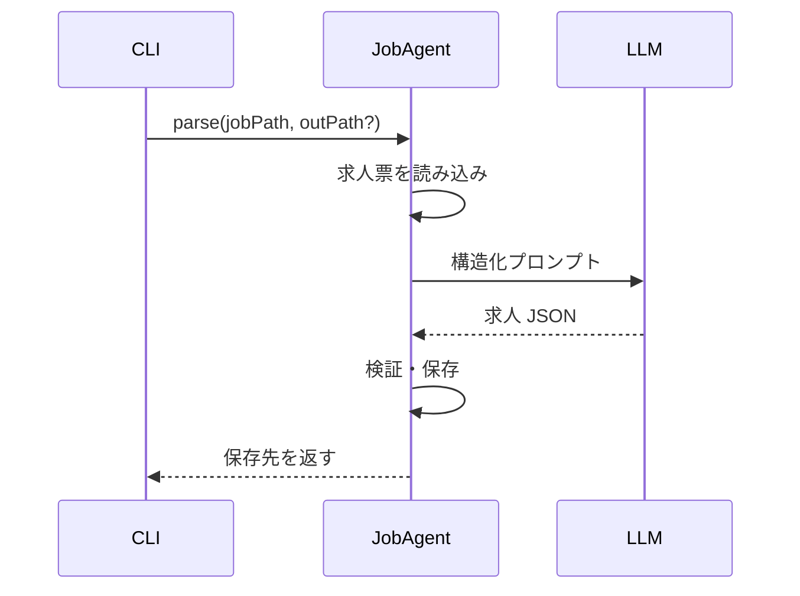
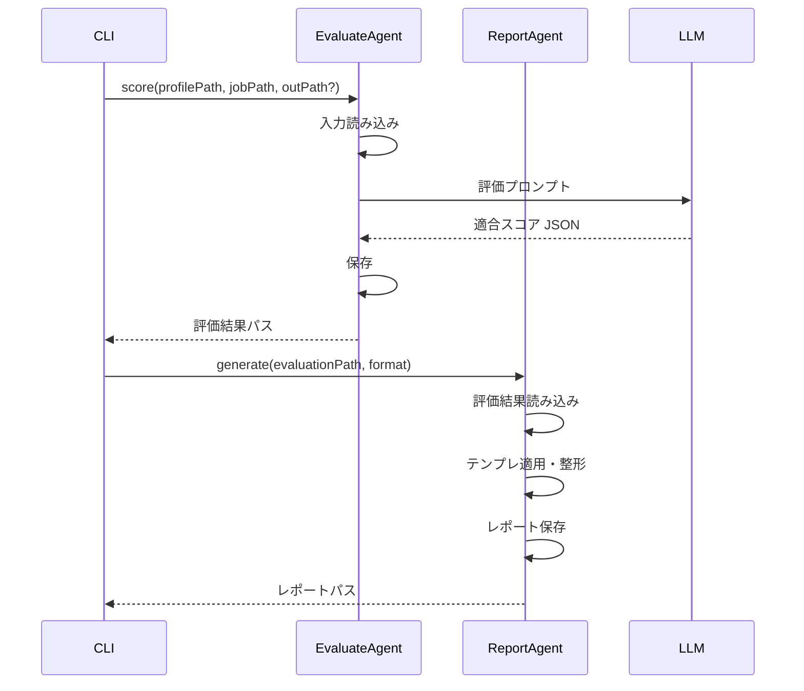

# 基本設計: キャリアエージェントのサブエージェント指向アーキテクチャ

## 1. 基本思想

本プロダクトは「必要な機能部品を必要なときに直接呼び出す」シンプルなエージェント群として構成する。
統合オーケストレーターは持たず、ユーザーもしくは外部スクリプトがサブエージェントを組み合わせてフローを構築する。

- **直接実行**: CLI から各エージェントのコマンドを呼び出し、完結した処理単位を提供する。
- **スクリプト連携**: 外部スクリプトが CLI／ライブラリ API を順番に実行し、複合フローを組み立てる。
- **状態の明示化**: プロフィールやレポートといった成果物はファイルとして永続化し、次のステップに明示的に受け渡す。

## 2. システム構成

### 2.1 ディレクトリ構成（抜粋）

```
src/
  cli.ts              # CLI エントリーポイント
  agents/
    profile_agent.ts  # プロフィール生成・閲覧
    job_agent.ts      # 求人データ解析
    evaluate_agent.ts # レジュメ × 求人の適合評価
    report_agent.ts   # レポート生成・閲覧
profiles/
  user_profile.json   # 最新プロフィール（Profile Agent が管理）
reports/
  *.json / *.md       # 評価結果レポート
```

### 2.2 コンポーネントと役割

| コンポーネント | 役割 | 主な入出力 |
| --- | --- | --- |
| `src/cli.ts` | コマンド解析と各エージェント呼び出し | ユーザー入力 → 各エージェント関数 |
| Profile Agent | 職務経歴・キャリアプランを解析してプロフィール JSON を生成／閲覧し、不足情報があれば対話的ヒアリングで補完 | 入力: ユーザー提供テキスト（貼り付け／質問回答／`--file` 指定の文書）<br>出力: `profiles/user_profile.json` |
| Job Agent | 求人票を解析し、構造化データを生成 | 入力: 求人票ファイル<br>出力: `job_data/*.json` など |
| Evaluate Agent | プロフィールと求人データから適合度評価を算出 | 入力: プロフィール JSON・求人 JSON<br>出力: 評価結果 JSON |
| Report Agent | 評価結果の整形表示／保存／一覧化 | 入力: 評価結果 JSON<br>出力: Markdown/JSON レポート、一覧 |

### 2.3 永続化ポリシー

- プロフィール: `profiles/user_profile.json`
- 求人解析結果: `job_data/<job-id>.json`（生成先はオプションで指定）
- 評価結果レポート: `reports/<timestamp>_<job-id>.json` など
- 記録フォーマットは JSON を基準とし、利用者が次のエージェントに渡しやすい構造を保持する。

### 2.4 外部依存

- LLM 呼び出し: Profile Agent（プロフィール抽出・対話）、Evaluate Agent（適合度評価）など
- ファイル I/O: 各エージェントが成果物を読み書き

## 3. CLI コマンド体系

> 注記: 本節のコマンドおよびオプションは方向性を示すための概略であり、最終的な仕様は各エージェントの詳細設計書で確定する。

| コマンド | 種別 | 主なオプション | 説明 |
| --- | --- | --- | --- |
| `profile create` | プロフィール初期生成 | `--file <path>` `--no-interactive` `--force` | ペーストしたテキストや対話回答を解析してプロフィール JSON を新規作成。`--file` は複数指定可。既存ファイルがある場合は `--force` で上書き。ヒアリングが既定で実行され、`--no-interactive` 指定時のみスキップ。 |
| `profile update` | プロフィール更新 | `--fields <list>` `--file <path>` `--no-interactive` | 既存プロフィールの特定領域を再生成／補完。補足テキストは貼り付け／`--file` 指定で入力。ヒアリングを既定で行い、必要に応じて `--no-interactive` で無効化。 |
| `profile show` | プロフィール閲覧 | `--format <format>` | 保存済みプロフィールを表示。`text`（既定）と `json` を想定。 |
| `job parse` | 求人解析 | `--file <path>` `--out <path>` | 求人票を解析し、構造化データを保存。 |
| `job show` | 求人閲覧 | `--file <path>` / `--id <job-id>` | 解析済み求人データを表示。 |
| `evaluate score` | 適合評価 | `--profile <path>` `--job <path>` `--out <path>` | プロフィールと求人データから適合スコアを算出し保存。 |
| `report generate` | レポート作成 | `--evaluation <path>` `--format <format>` | 評価結果をレポートとして整形・保存。`md` と `json` を想定。 |
| `report list` / `report show` | レポート管理 | `--id <report>` 等 | 生成済みレポートの確認。 |
| `compare` | レポート比較 | `--reports <path...>` | 複数レポートの比較指標を算出。 |

### 3.1 代表的な利用シナリオ

1. **プロフィール初期作成 → 求人解析 → 適合評価 → レポート生成**
   1. `profile create --file cv.md --file plan.md`
   2. `job parse --file jobs/foo.md --out job_data/foo.json`
   3. `evaluate score --profile profiles/user_profile.json --job job_data/foo.json --out evaluations/foo.json`
   4. `report generate --evaluation evaluations/foo.json --format md`

2. **既存プロフィールで新規求人を評価**
   1. `job parse --file jobs/bar.md`
   2. `evaluate score --profile profiles/user_profile.json --job job_data/bar.json`
   3. 必要に応じて `report generate` / `report show`

3. **プロフィールの部分更新**
   1. `profile update --fields skills,values --file notes/skill-updates.md`
   2. LLM との対話で不足情報を補完しつつ対象領域を再生成（ヒアリングを省略する場合は `--no-interactive` を付与）

## 4. 処理フロー

### 4.1 `profile create`



### 4.2 `profile update`



### 4.3 `job parse`



### 4.4 `evaluate score` + `report generate`



## 5. 今後の拡張

- **半自動フローのテンプレ化**: よく使う手順をスクリプト化し、ユーザーの手動操作を最小化。
- **対話的ヒアリングの充実**: Profile Agent の質問テンプレートや回答ストレージを拡張し、再利用可能な知識ベース化を検討。
- **軽量オーケストレーション**: 定番フローが固まった段階で、小規模なルールベースワークフロー（もしくは LLM プランナー）を導入する余地を残す。
- **マルチユーザー対応**: プロフィール／レポートの保存先をユーザーごとに分離し、サブエージェント API を再利用できるようにする。
