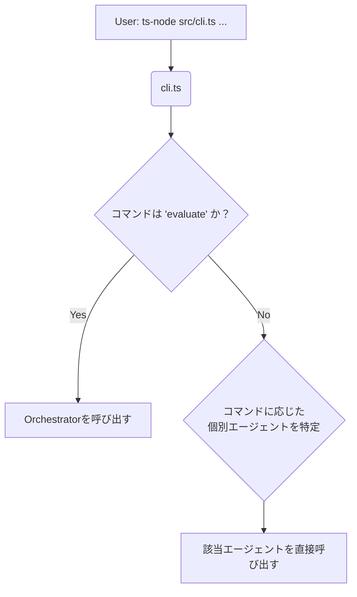
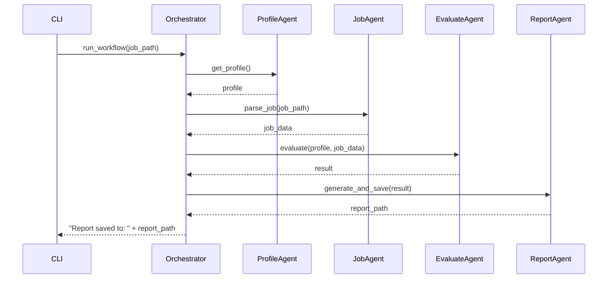
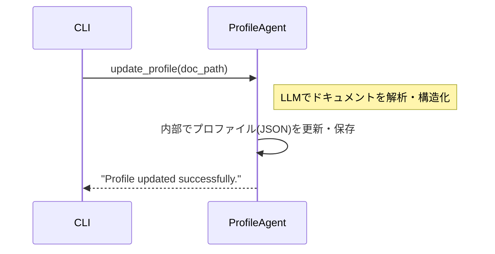

# キャリアエージェントのシステム設計案

## 1. 基本思想

本システムは、「手軽な自動化」と「柔軟な部品利用」を両立させるためのアプローチを採用する。

- インターフェース1：オーケストレーター経由（統合コマンド）
    - 目的: 標準的な評価ワークフローをワンコマンドで実行する。
    - 利用者: 一般ユーザー。
    - 例: `evaluate` コマンドで、求人評価の全工程を自動実行。

- インターフェース2：エージェント直接呼び出し（個別コマンド）
    - 目的: 特定の機能を個別に実行する。
    - 利用者: パワーユーザー、開発者、外部スクリプト。
    - 例: `profile update` や `report list` など、必要な部品（エージェント）だけを呼び出す。

この設計により、ユーザーは習熟度や目的に応じて、システムの利用方法を選択できる。

## 2. システム構成

### 2.1. ディレクトリ構成

```
/
├── specifications/
├── profiles/
│   └── user_profile.json
├── jobs/
├── reports/
├── src/
│   ├── agents/
│   │   ├── index.ts
│   │   ├── profile_agent.ts
│   │   ├── job_agent.ts
│   │   └── evaluate_agent.ts
│   ├── services/
│   ├── commands/
│   └── cli.ts  # コマンドのルーティングを担当
├── package.json
└── tsconfig.json
```

### 2.2. コンポーネントの役割

- `src/cli.ts` (コマンドラインインターフェース):
    - 最重要コンポーネント。 ユーザーからのコマンドを解釈し、オーケストレーターまたは適切な個別エージェントへのルーティング（振り分け）を行う。

- `src/orchestrator.ts` (オーケストレーター):
    - 統合コマンド (`evaluate`) の実体。 複数のエージェントを決められた順序で呼び出し、一連のワークフローを実行する。

- `src/agents/` (個別エージェント群):
    - 個別コマンドの実体。 それぞれが単一の責務を持つ機能部品。

## 3. コマンド体系 (CLI設計)

`cli.ts` は、以下のコマンド体系をユーザーに提供する。

| コマンド | 種別 | 呼び出し先 | 説明 |
| :--- | :--- | :--- | :--- |
| `evaluate` | 統合 | `orchestrator` | 指定された求人情報の評価フロー全体を実行する。 |
| `profile <subcommand>` | 個別 | `profile_agent` | ユーザープロファイルを管理する。 |
| `job <subcommand>` | 個別 | `job_agent` | 求人情報の解析や管理を行う。 |
| `report <subcommand>` | 個別 | `report_agent` | 評価レポートの管理を行う。 |
| `compare` | 個別 | `evaluate_agent` | 複数のレポートを比較・分析する。 |

### 3.1. サブコマンド詳細

- `profile`
    - `update --file <path>`: 職務経歴書ファイルからプロファイルを更新する。
    - `show`: 現在のプロファイル情報を表示する。

- `job`
    - `parse --file <path>`: 求人情報ファイルを解析し、構造化データとして出力する。

- `report`
    - `list`: 生成済みの評価レポートの一覧を表示する。
    - `show <report_name>`: 指定されたレポートの内容を表示する。

## 4. 処理フローの視覚化

### 4.1. CLIのルーティング処理



### 4.2. オーケストレーターの処理フロー (`evaluate` コマンド実行時)



### 4.3. 個別エージェントの処理フロー (`profile update` コマンド実行時)



## 5. まとめ

この設計により、システムは以下の2つの側面を持つことになる。

1.  アプリケーションとして: `evaluate`コマンドにより、誰でも簡単に使える求人評価ツールとして機能する。
2.  フレームワークとして: `profile`, `job`, `report`などの個別コマンドにより、開発者は機能を部品として再利用し、より複雑な自動化スクリプトを構築できる。
